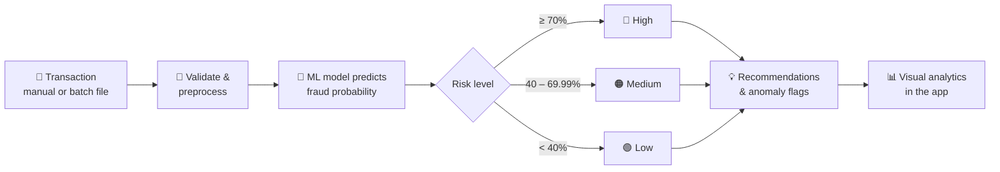

<div align="center">


<p>
  
  
  
  
  
</p>

<h3>🛡️ Detecting risk before it becomes a loss.</h3>

<p>
  Real-time fraud detection with risk scoring, transaction analytics,<br/>
  and a clean full-stack interface for financial monitoring teams.
</p>

<p>
  <a href="#-overview">Overview</a> •
  <a href="#-key-features">Features</a> •
  <a href="#-how-it-works">How It Works</a> •
  <a href="#-api-endpoints">API</a> •
  <a href="#-quick-start">Quick Start</a> •
  <a href="#-deployment">Deployment</a>
</p>

</div>

---

## 📖 Overview

**Sentinel** is a full-stack fraud detection application built to identify suspicious online financial activity using a machine learning model, explainable risk classification, and rich analytical visuals. The platform blends automated detection with actionable intelligence for safer transaction monitoring.

| Layer | What it does |
|:------|:-------------|
| ⚙️ **Backend** | Python + FastAPI for prediction and batch processing |
| 🖥️ **Frontend** | React + Vite for interactive monitoring and dashboards |
| 🧠 **ML Pipeline** | Trained model for fraud probability estimation |
| 📊 **Analytics** | Generated chart outputs for operational analysis and reporting |

---

## ✨ Key Features

- ⚡ **Real-time prediction** for single transactions
- 📂 **Batch upload** support for CSV and JSON files
- 🚦 **High / Medium / Low** risk classification
- 💡 **Recommendation engine** for flagged transactions
- 🔍 **Anomaly detection signals** for suspicious behavior
- 📈 **Frontend dashboards** driven by generated analytics visuals
- 📦 **Persisted model + preprocessing pipeline** ready for production use

---

## 🧰 Tech Stack

| Category | Technologies |
|:---------|:-------------|
| **Backend** | Python, FastAPI |
| **Machine Learning** | scikit-learn, pandas, NumPy |
| **Frontend** | React, Vite |
| **Data Handling** | CSV / JSON ingestion and preprocessing |
| **Visualization** | Matplotlib-based chart generation |
| **Deployment** | Docker-ready backend, Vercel-ready frontend |

---

## 🗂️ Repository Structure

```text
Sentinel/
├── backend/
│   ├── main.py
│   ├── Fraud_Analysis.py
│   ├── Fraud_Detection.ipynb
│   ├── Model.pkl
│   ├── Preprocessor.pkl
│   ├── requirements.txt
│   └── Dockerfile
├── frontend/
│   ├── src/
│   ├── public/
│   ├── package.json
│   ├── vite.config.js
│   ├── serve.js
│   └── README.md
├── Data/
├── Outputs/
├── main.py
├── .gitignore
├── README.md
└── .github/
```

---

## 🔄 How It Works



### 🚦 Risk Levels

| Level | Fraud Probability |
|:-----:|:-----------------:|
| 🔴 **High Risk** | `>= 70%` |
| 🟠 **Medium Risk** | `40% – 69.99%` |
| 🟢 **Low Risk** | `< 40%` |

---

## 🔌 API Endpoints

| Method | Route | Description |
|:------:|:------|:------------|
| `GET` | `/` or `/health` | Service health check |
| `POST` | `/predict` | Predict fraud probability for a single transaction |
| `POST` | `/analyze/upload` | Process a CSV or JSON file with multiple transactions |
| `GET` | `/analytics/visuals` | Fetch analytics metadata and generated visual paths |
| `POST` | `/analytics/regenerate-from-data` | Regenerate chart output from uploaded transaction data |

### 🧪 Example

<details open>
<summary><b>Request payload</b></summary>

```json
{
  "step": 10,
  "Type": "TRANSFER",
  "Amount": 50000,
  "OldbalanceOrg": 100000,
  "NewbalanceOrig": 20000,
  "NewbalanceDest": 0
}
```

</details>

<details open>
<summary><b>Response</b></summary>

```json
{
  "Prediction": "High Risk",
  "Fraud_probability": 89.43,
  "Recommendation_Actions to be taken": [
    "Review destination account activity.",
    "Transaction occurred during late-night hours. Apply enhanced transaction verification.",
    "Perform additional verification for this high-risk transaction type."
  ]
}
```

</details>

---

## 🚀 Quick Start

### 1️⃣ Backend

```bash
cd backend
python -m venv .venv
source .venv/bin/activate   # Windows: .venv\Scripts\activate
pip install -r requirements.txt
uvicorn main:app --reload --host 0.0.0.0 --port 8000
```

> 🌐 API available at **http://localhost:8000**

### 2️⃣ Frontend

```bash
cd frontend
npm install
npm run dev
```

> 🌐 Frontend available at **http://localhost:5173**

---

## ☁️ Deployment

- 🐳 The backend runs with **Uvicorn** and is compatible with **Docker**-based deployment.
- ▲ The frontend is built for **Vite** and suits **Vercel** or similar hosting platforms.
- 🖼️ Visual outputs are exposed through the backend static route, making them available to the frontend dashboards.

---

## 💎 Why Sentinel?

Sentinel is built for teams that need a practical, fast, and visual fraud-monitoring solution:

| | |
|:--|:--|
| 🧠 **Smart** | Machine learning-based detection |
| 🎯 **Actionable** | Operational recommendations for analysts |
| 📊 **Insightful** | Rich transaction dashboards |
| 🪶 **Lightweight** | Easy deployment for real-world monitoring workflows |

---

## 📌 Project Status

✅ The repository includes a working fraud detection model, backend API, frontend interface, and analytics layer, making it a functional full-stack intelligence project for transaction risk monitoring.

---

## 📄 License

This project does not currently include a license file. If you plan to distribute or publish it publicly, consider adding an open-source license such as **MIT** or **Apache 2.0**.

---

## 🤝 Contributors

Built as a full-stack fraud detection and analytics project focused on online transaction risk intelligence.

---

<div align="center">

<b>🛡️ Sentinel</b> — detecting risk before it becomes a loss.


</div>
